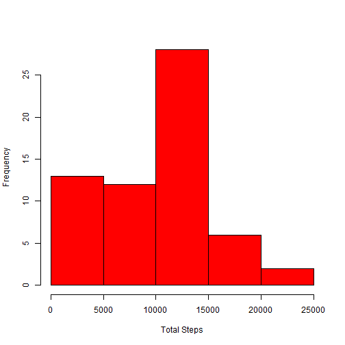
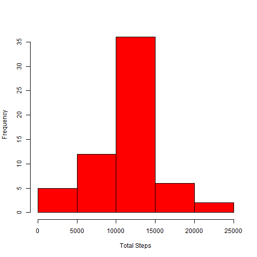

## 1. Loading and preprocessing the data


```r
measures <- read.csv("activity.csv", stringsAsFactors=FALSE)
```

## 2. What is mean total number of steps taken per day?


```r
q1 <- aggregate(measures$steps, by=list(measures$date), FUN=sum, na.rm=TRUE)
colnames(q1) <- c("ActivityDate", "TotalSteps")
hist(q1$TotalSteps, main=" ", xlab = "Total Steps", col="red")
```

 

####Mean value of Total Number of Steps Daily =  9354.2295  

####Median value of Total Number of Steps Daily = 10395

## 3. What is the average daily activity pattern?

```r
q2 <- aggregate(measures$steps, by=list(measures$interval), FUN=mean, na.rm=TRUE)
colnames(q2) <- c("interval", "AverageSteps")
plot(q2$interval, q2$AverageSteps, type = "l", xlab ="Interval", ylab="Average Steps")
```

 

```r
maxIndx <- which(q2$AverageSteps == max(q2$AverageSteps))
```
####The interval with Maximum Average Steps = 835  


## 4. Imputing missing values   

#### Number of Intervals with missing values = 2304

Imputing the NA values with the average number of steps for that interval

```r
q3 <- merge(measures, q2, by="interval")
q3<- q3[order(q3$date, q3$interval), ]
colIndx <- which(is.na(q3$steps))
q3$steps[colIndx]=q3$AverageSteps[colIndx]
```
Creating a new data frame q4 that is same as original values but has NA substituted with avg no of steps

```r
q4 <- q3[c("steps","date","interval")]
head(q4)
```

```
##       steps       date interval
## 1   1.71698 2012-10-01        0
## 63  0.33962 2012-10-01        5
## 128 0.13208 2012-10-01       10
## 205 0.15094 2012-10-01       15
## 264 0.07547 2012-10-01       20
## 327 2.09434 2012-10-01       25
```
Plot a histogram of total steps after imputing NA values in the original dataset

```r
q5 <- aggregate(q4$steps, by=list(q4$date), FUN=sum, na.rm=TRUE)
colnames(q5) <- c("ActivityDate", "TotalSteps")
hist(q5$TotalSteps, main=" ", xlab = "Total Steps", col="red")
```

 

####Mean value of Total Number of Steps Daily =  10766 

####Median value of Total Number of Steps Daily = 10766  


####The mean and median of the data set with imputed values (q5) is more than that of the data set in question 1 above (q1).  


## Are there differences in activity patterns between weekdays and weekends?
