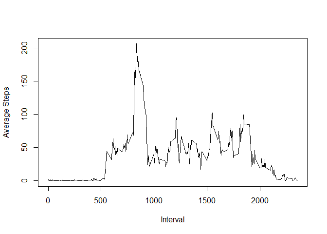

# Reproducible Research: Peer Assessment 1


```r
require(knitr)
```

```
## Loading required package: knitr
```

```r
library(lattice)
opts_chunk$set(echo=TRUE)
```

### Step 1: Loading and preprocessing the data from CSV file

```r
activityData <- read.csv("activity.csv", stringsAsFactors=FALSE)
```

### Step 2: What is mean total number of steps taken per day?

##### Plotting histogram of total steps taken by day..

```r
totalStepsByDay <- aggregate(activityData$steps, by=list(activityData$date), FUN=sum, na.rm=TRUE)
colnames(totalStepsByDay) <- c("ActivityDate", "TotalSteps")
hist(totalStepsByDay$TotalSteps, main=" ", xlab = "Total Steps", col="red")
```

 

```r
meanTotalstepsbyDay <- mean(totalStepsByDay$TotalSteps)
medianTotalstepsbyDay <- median(totalStepsByDay$TotalSteps)

print(paste("Mean value of Total Number of Steps Daily =  ", meanTotalstepsbyDay))
```

```
## [1] "Mean value of Total Number of Steps Daily =   9354.22950819672"
```

```r
print(paste("Mean value of Total Number of Steps Daily =  ", medianTotalstepsbyDay))
```

```
## [1] "Mean value of Total Number of Steps Daily =   10395"
```

####Mean of Total Number of Steps Daily = 9354.23  
####Median of Total Number of Steps Daily= 10395  

---
   
    
### Step 3: What is the average daily activity pattern?

```r
avgDailyActivity <- aggregate(activityData$steps, by=list(activityData$interval), FUN=mean, na.rm=TRUE)
colnames(avgDailyActivity) <- c("interval", "AverageSteps")
#avgDailyActivity
```
##### Plotting average number of steps for each time interval..

```r
plot(avgDailyActivity$interval, avgDailyActivity$AverageSteps, type = "l", xlab ="Interval", ylab="Average Steps")
```

 

```r
maxIndx <- which(avgDailyActivity$AverageSteps == max(avgDailyActivity$AverageSteps))  
intervalMaxAvgSteps <- avgDailyActivity$interval[maxIndx]
print(paste("The interval with Maximum Average Steps = ", intervalMaxAvgSteps))
```

```
## [1] "The interval with Maximum Average Steps =  835"
```

####The interval with Maximum Average Steps =  835

---

### Step 4: Imputing missing values from original data set   

#####Calculating below the number of intervals with missing values ..

```r
print(paste("Number of Intervals with missing values = ",  sum(is.na(activityData$steps))))
```

```
## [1] "Number of Intervals with missing values =  2304"
```
####Number of observations with missing values = 2304
  
######Imputing the NA values with the average number of steps for that interval

```r
activityData.Temp <- merge(activityData, avgDailyActivity, by="interval")
activityData.Temp<- activityData.Temp[order(activityData.Temp$date, activityData.Temp$interval), ]
colIndx <- which(is.na(activityData.Temp$steps))
activityData.Temp$steps[colIndx]=activityData.Temp$AverageSteps[colIndx]
```

##### Creating a new data frame activityData.noNAs that is same as original data set but has NAs substituted with average no. of steps


```r
activityData.noNAs <- activityData.Temp[c("steps","date","interval")]
```
##### Plot a histogram of total steps after imputing NA values in the original dataset


```r
totalStepsByDay.noNAs <- aggregate(activityData.noNAs$steps, by=list(activityData.noNAs$date), FUN=sum, na.rm=TRUE)
colnames(totalStepsByDay.noNAs) <- c("ActivityDate", "TotalSteps")
hist(totalStepsByDay.noNAs$TotalSteps, main=" ", xlab = "Total Steps", col="red")
```

 

```r
meanTotalstepsbyDay.noNAs  <- mean(totalStepsByDay.noNAs$TotalSteps)
medianTotalstepsbyDay.noNAs  <- median(totalStepsByDay.noNAs$TotalSteps)
```

#####Prinitng Mean and Median values for toal number of steps after imputing NAs

```r
print(paste("Mean value of Total Number of Steps Daily =  ", meanTotalstepsbyDay.noNAs))
```

```
## [1] "Mean value of Total Number of Steps Daily =   10766.1886792453"
```

```r
print(paste("Median value of Total Number of Steps Daily =  ", medianTotalstepsbyDay.noNAs))  
```

```
## [1] "Median value of Total Number of Steps Daily =   10766.1886792453"
```

####Mean value of Total Number of Steps Daily =   10766.19
####Median value of Total Number of Steps Daily =   10766.19

--- 

####The mean of the data set with imputed values (totalStepsByDay.noNAs) is more than that of the original data set (activityData)

---

####The median of the data set with imputed values (totalStepsByDay.noNAs) is more than that of the original data set (activityData)
 
---


### step 5: Are there differences in activity patterns between weekdays and weekends?

```r
activity.Weekends <- activityData.noNAs
activity.Weekends$dayType <- as.factor(ifelse(weekdays(as.Date(activity.Weekends$date, "%Y-%m-%d")) %in% 
                                                c("Saturday","Sunday"), "weekend", "weekday"))

activityComparison <- aggregate(activity.Weekends$steps, by=list(activity.Weekends$interval, 
                                                activity.Weekends$dayType), FUN=mean, na.rm=TRUE)

colnames(activityComparison) <- c("interval", "dayType", "AverageSteps")
```
##### Plotting average steps by interval for Weekday vs. Weekend

```r
xyplot(activityComparison$AverageSteps ~ activityComparison$interval | activityComparison$dayType, 
       data=activityComparison, type = "l",layout=c(1,2), xlab = "Interval", ylab = "Number of steps")
```

 
